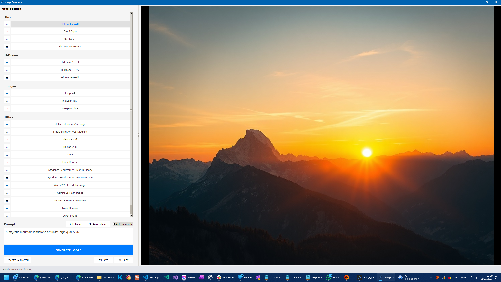

# AI Image Workbench

A Python/Tkinter desktop application for generating images with a large set of fal.ai models. AI Image Workbench is designed for fast model comparison on a single prompt, with a responsive UI, cached per-model results, prompt enhancement, queue visibility, and save/copy workflows.



## Features

- Support for a broad mix of fal.ai image models, including Flux, Imagen, HiDream, Ideogram, Gemini, Qwen, WAN, BRIA, Phota, and other text-to-image endpoints.
- Model memory cache that remembers the last generated image per model for the current prompt, so switching between tried models is instant.
- Visual model indicators for generated, viewed, starred, hidden, queued, failed, and selected states.
- Parallel generation for starred models to compare multiple outputs from one prompt.
- Prompt enhancement through OpenRouter using Grok 4.1 Fast, with optional user directions.
- Auto-generate support for selected fast models while typing.
- Responsive image viewer with zoom, pan, fit-to-window behavior, and thumbnail-aware queue interactions.
- Save to disk and copy-to-clipboard actions for generated images.
- Light and dark themes, persisted window layout, persisted splitter positions, and persisted hidden-model preferences.
- Queue overlay that shows request status, lets you review completed items, and surfaces failures without blocking the main UI.
- Background request handling so the interface stays responsive during generation.

## Requirements

- Python 3.10 or newer recommended.
- Tkinter, which is bundled with most standard Python installers.
- A fal.ai API key in `FAL_KEY`.
- An OpenRouter API key in `OPENROUTER_API_KEY` if you want prompt enhancement.

## Installation

1. Clone the repository.

   ```bash
   git clone https://github.com/vbandi/ai-image-workbench.git
   cd ai-image-workbench
   ```

2. Create and activate a virtual environment.

   Windows PowerShell:

   ```powershell
   python -m venv .venv
   .\.venv\Scripts\Activate.ps1
   ```

   macOS/Linux:

   ```bash
   python -m venv .venv
   source .venv/bin/activate
   ```

3. Install the runtime dependencies.

   ```bash
   pip install fal-client openai pillow requests
   ```

4. Set the required environment variables.

   Windows PowerShell:

   ```powershell
   $env:FAL_KEY = "your-fal-key"
   $env:OPENROUTER_API_KEY = "your-openrouter-key"
   ```

   macOS/Linux:

   ```bash
   export FAL_KEY="your-fal-key"
   export OPENROUTER_API_KEY="your-openrouter-key"
   ```

   `OPENROUTER_API_KEY` is optional if you do not use prompt enhancement.

## Running The App

Start the main desktop app with:

```bash
python main.py
```

Or launch it as a package from the parent directory:

```bash
python -m image_generator
```

Typical workflow:

1. Choose a model from the left sidebar.
2. Enter a prompt.
3. Optionally enhance the prompt.
4. Generate a single image or generate across starred models.
5. Switch between cached model outputs instantly.
6. Save or copy the current image.

## Project Structure

- `main.py` is the main application entry point.
- `ui_components.py` contains the model-selection and prompt UI components.
- `image_gen_api.py` handles fal.ai model configuration, request submission, and response parsing.
- `ai_api.py` handles prompt enhancement via OpenRouter.
- `image_handler.py` manages image display, zoom, and pan behavior.
- `generation_manager.py` and `threading_utils.py` manage background execution and queue state.
- `settings_manager.py` persists window, theme, and visibility settings.
- `clipboard_manager.py` provides clipboard integration.

## Notes

- The app keeps model-memory images in RAM only. They are not persisted to disk unless you explicitly save them.
- Clipboard support is currently optimized for Windows.
- Local app settings are stored outside the repository in the user profile directory.

## License

This project is licensed under the MIT License. See the `LICENSE` file for details.