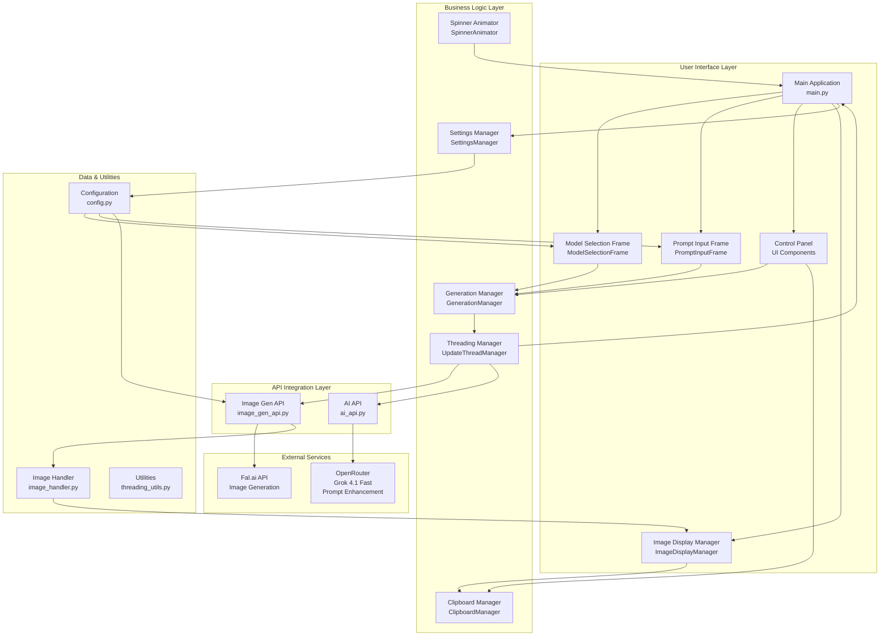
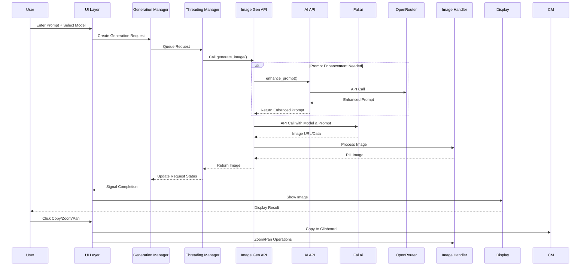
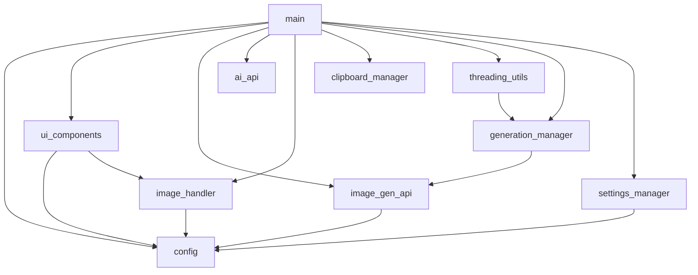
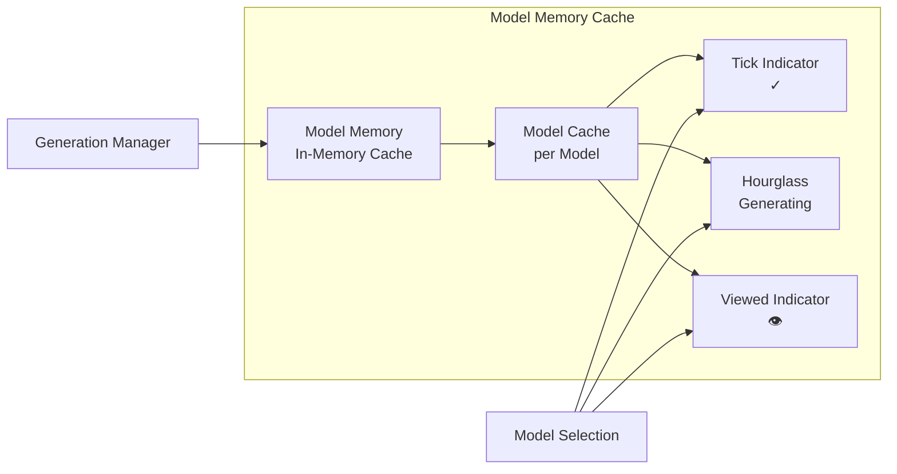
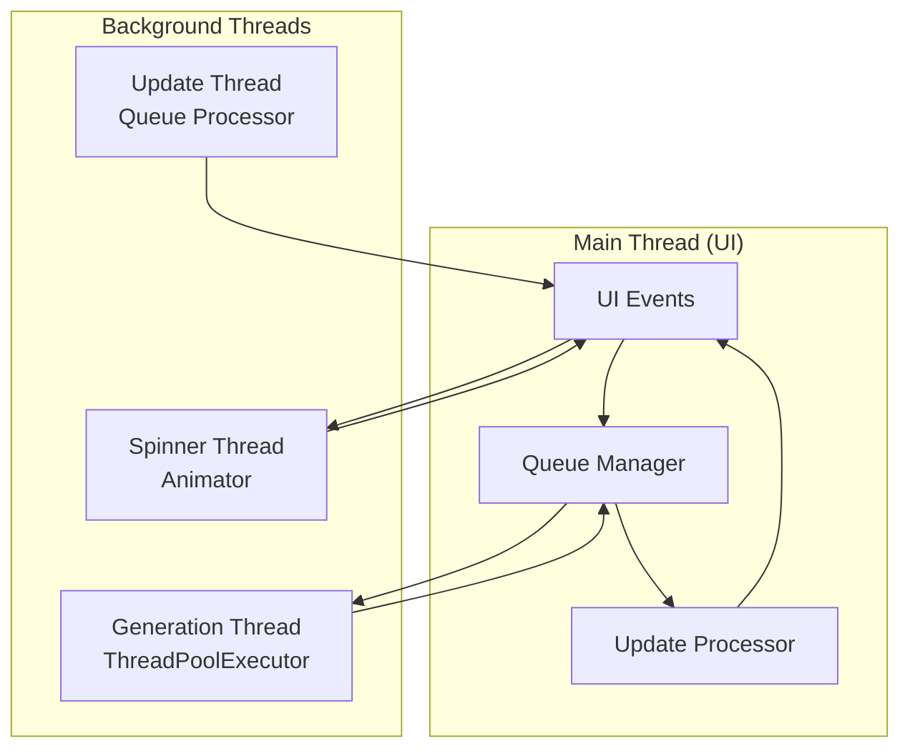
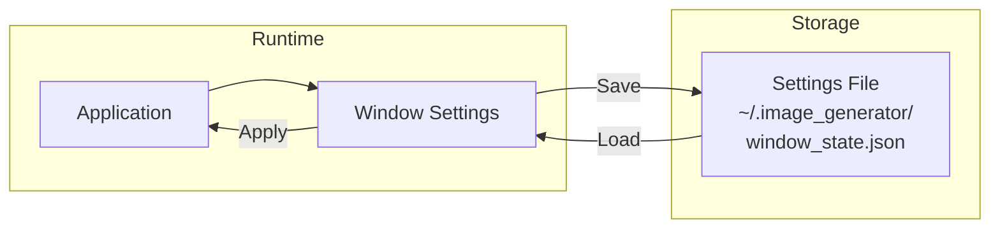

# AI Image Workbench Architecture

## Component Overview

## Data Flow Diagram

## Module Dependencies

## Key Features Architecture

### 1. Model Memory System

### 2. Threading & Background Processing

### 3. Settings Persistence

## Component Responsibilities

| Component | Responsibility |
|-----------|----------------|
| **main.py** | Main application coordinator, event handling |
| **config.py** | Constants, model definitions, UI settings |
| **ui_components.py** | Specialized UI widgets (model selection, prompt input) |
| **image_gen_api.py** | Fal.ai API integration, response parsing |
| **ai_api.py** | OpenRouter API for prompt enhancement |
| **image_handler.py** | Image processing, zoom/pan, display management |
| **clipboard_manager.py** | Cross-platform clipboard operations |
| **threading_utils.py** | Background thread management, queue processing |
| **generation_manager.py** | Request queueing, status tracking, execution |
| **settings_manager.py** | Window state persistence |

## External Dependencies

- **Fal.ai API**: Image generation service
- **OpenRouter API**: Grok 4.1 Fast for prompt enhancement
- **Pillow (PIL)**: Image processing
- **Tkinter**: GUI framework
- **Requests**: HTTP client for API calls
